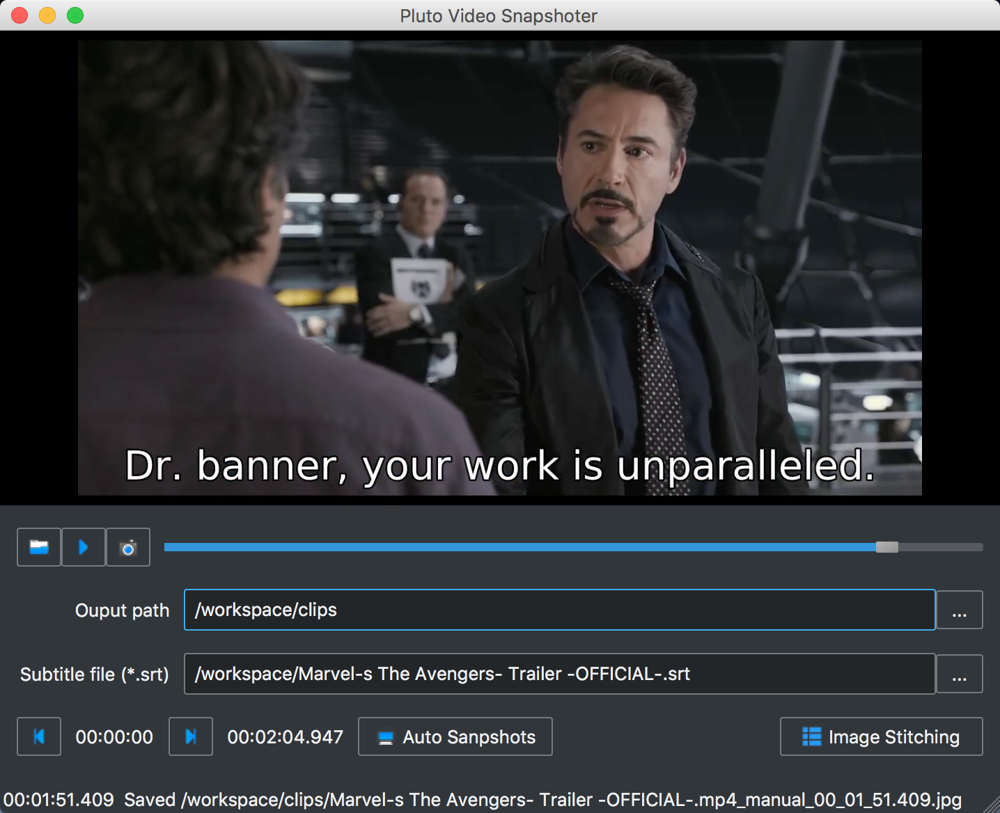
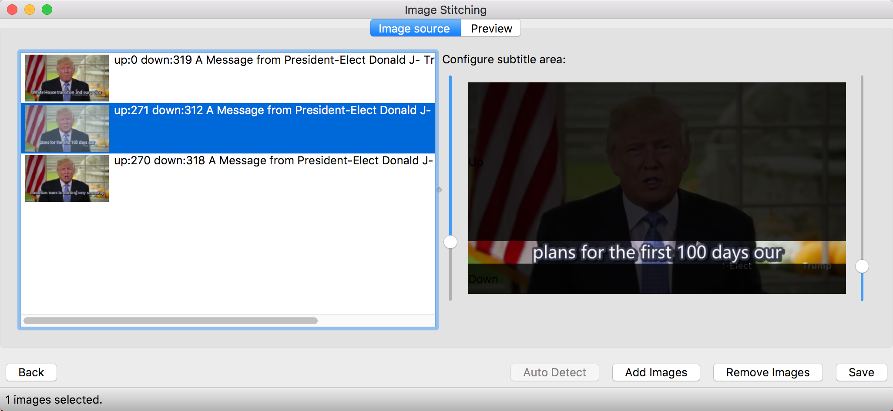
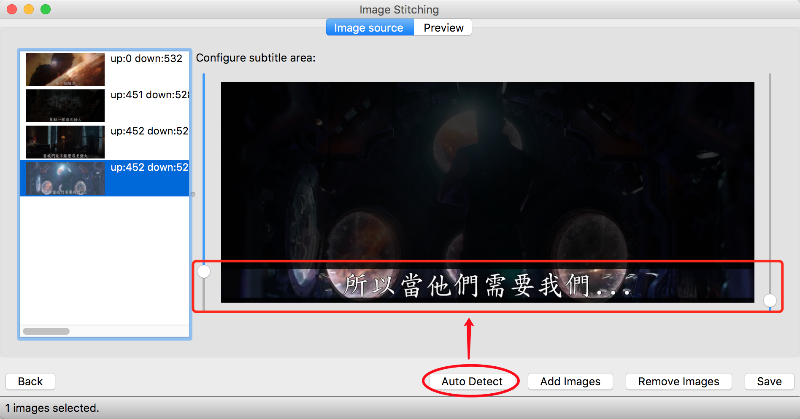
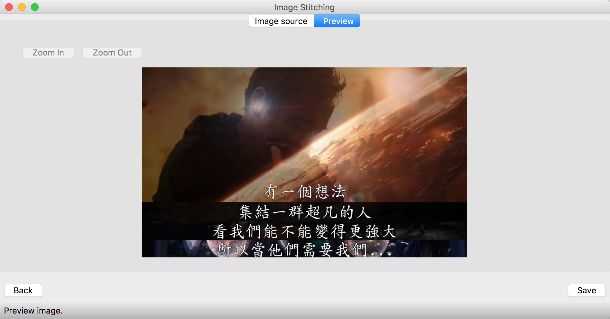

Pluto Video Snapshoter
======================

[](https://travis-ci.org/shootsoft/PlutoVideoSnapshoter)

# Features

- Automatically take snapshots for each slice of subtitles for a video with a given time range.
- Stitch snapshots into one image
- Automatically detect subtitle positions

# Usage

- Open the video
- Open srt file (optional, if the srt file doesn't have the same name of the video)
- Select output path (optional, if the output is different from video file's folder)
- Select time range (optional, default time range is 0:0:0 ~ video's duration time)
- Run task
- Concat snapshots









See [User Maual](doc/user_manual.md)

# Development

## Mac

Recommendation Python 3.6

```
sudo pip install -r requirements.txt
```

If met qt install failed, you may try 

```
brew install qt5
brew link qt5 --force
```

[Qt Designer](https://www.qt.io/download) is required for window UI design.

Running

```
python src/app.py
```

Building (not fully working yet)

```
python build.py
```

## Windows

Extra media codec required, recommend [K-Lite Codec Pack](http://www.codecguide.com/download_kl.htm)


## Tests

```bash
nosetests
```