PlutoVideoSanpshoter Usage
====

1. Launch application
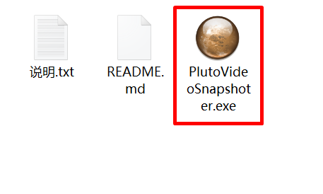
1. Open a video
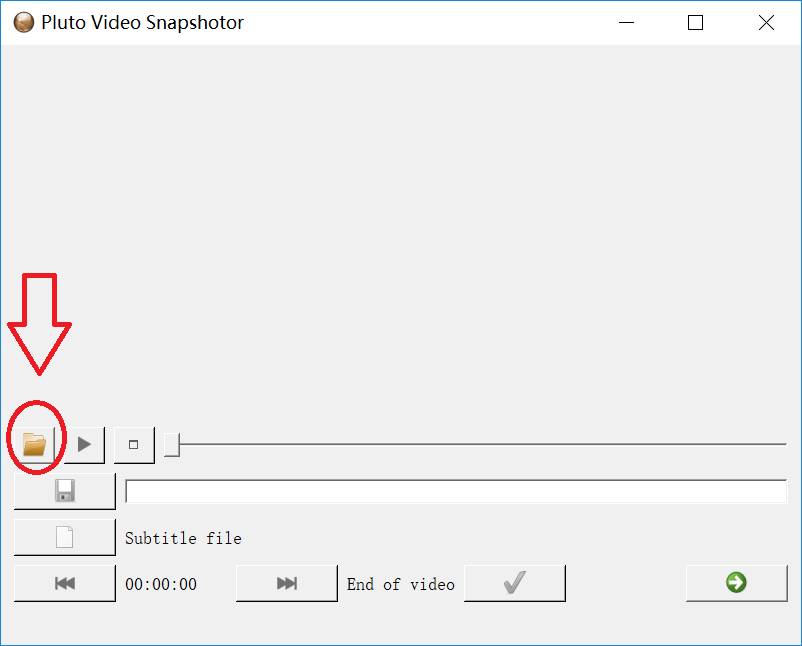
1. (Optional) Select snapshot output folder
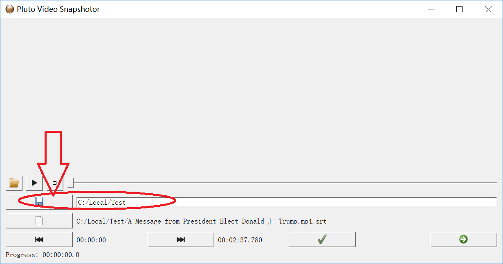
1. (Optional, this is required for auto snapshots) Open a subtitle file (*.srt). The file could be automatically detected if the file has the same name as the video file.
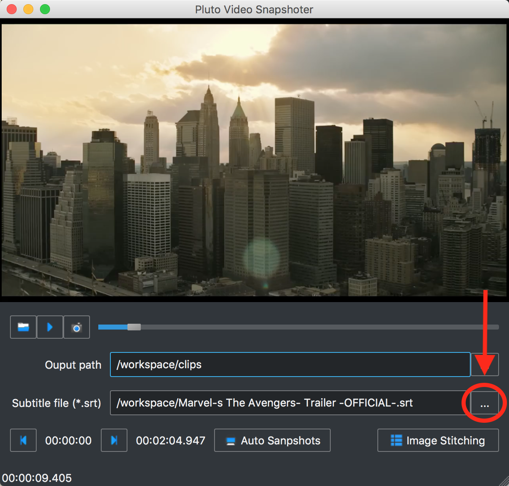
1. Play video and take single snapshot
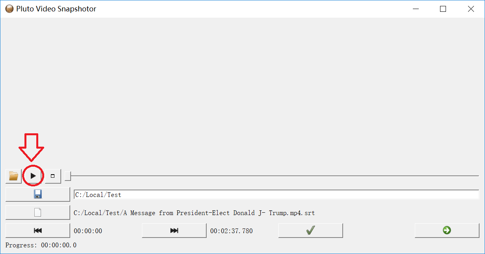
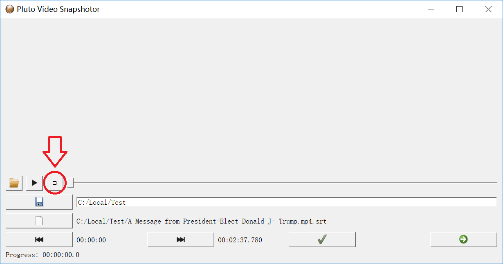
1. Select start and end, run auto snapshot for each line of subtitles.
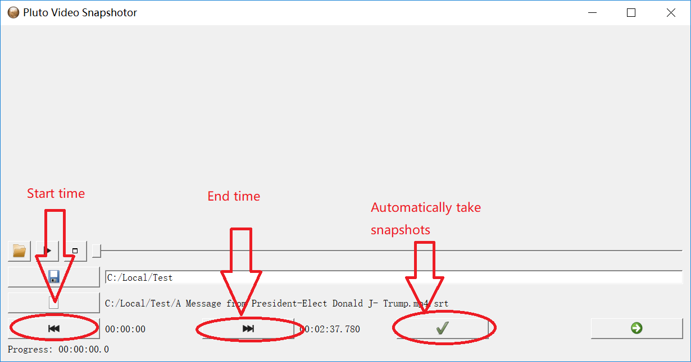
1. Jump to snapshot stitching
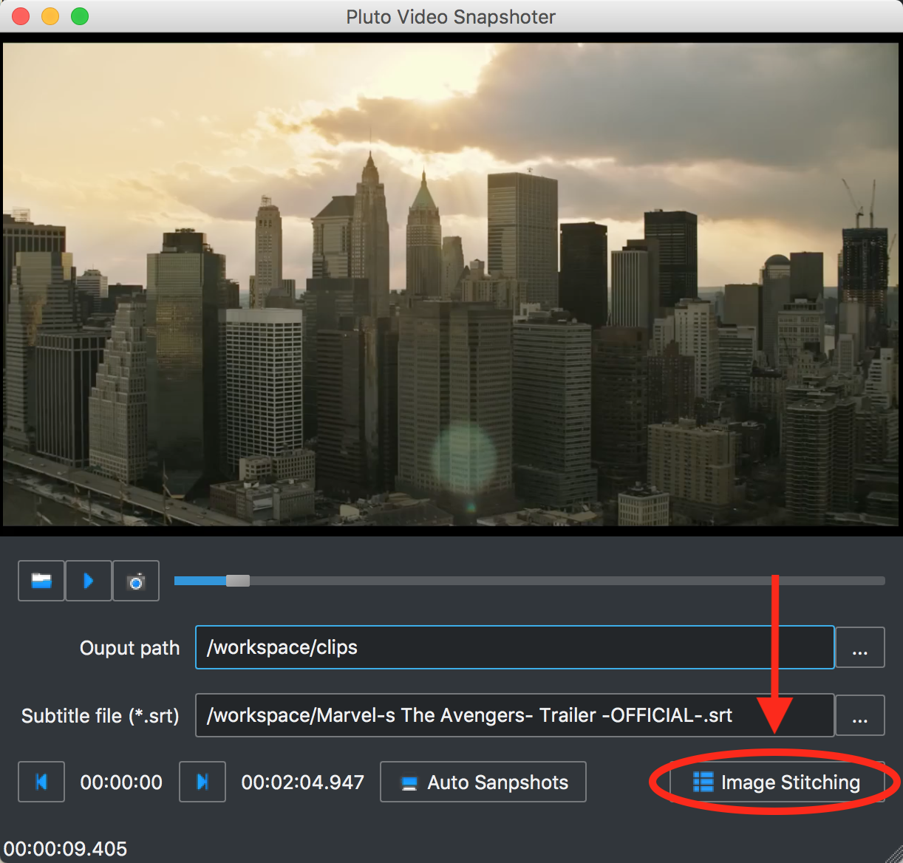
1. Select images and up limit and down limit
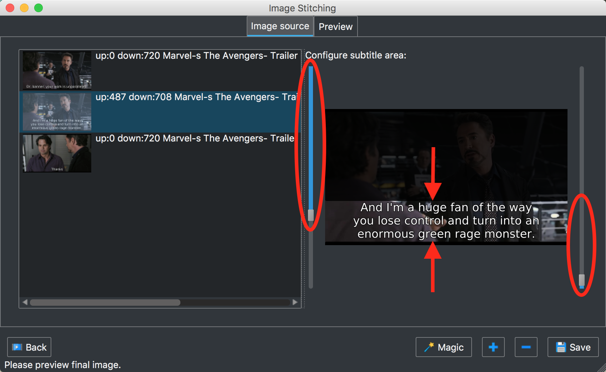
1. Preview stitched image
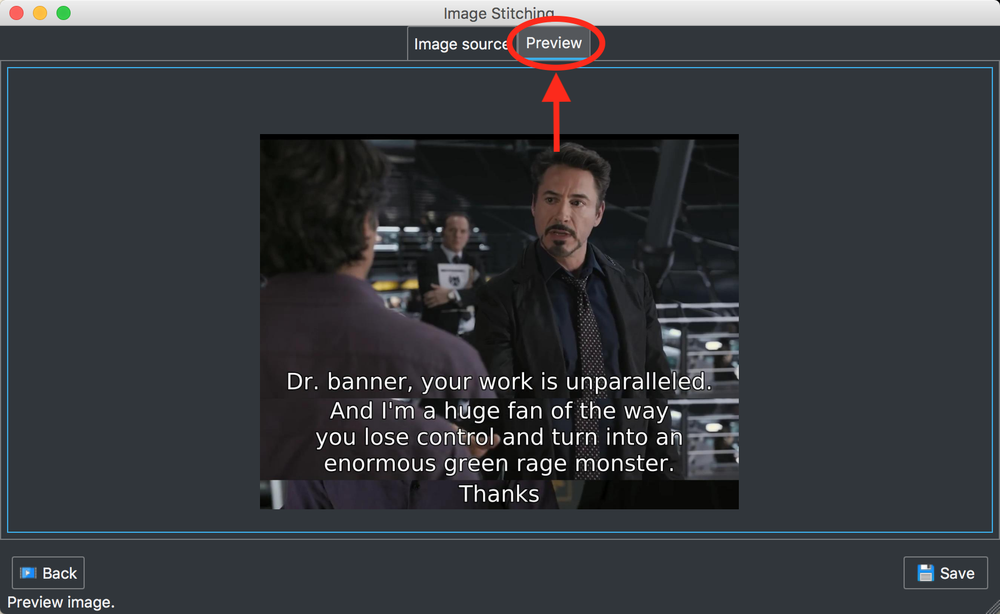
1. Save stitched image
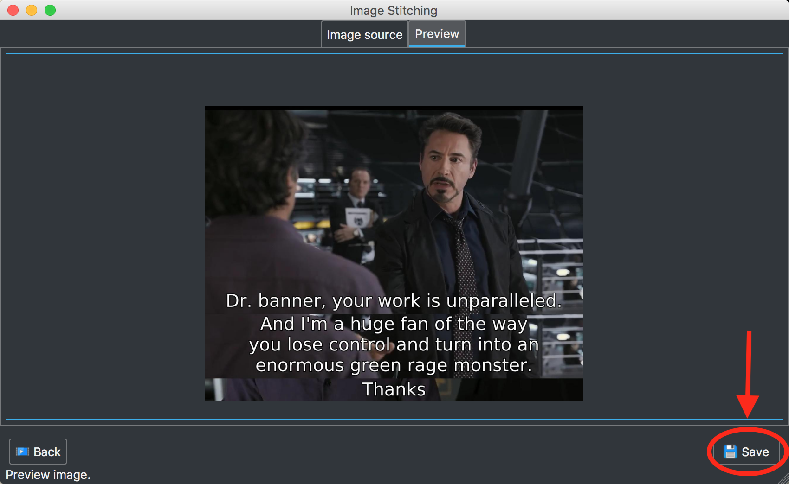

# Advanced

1. Preview/save selected images

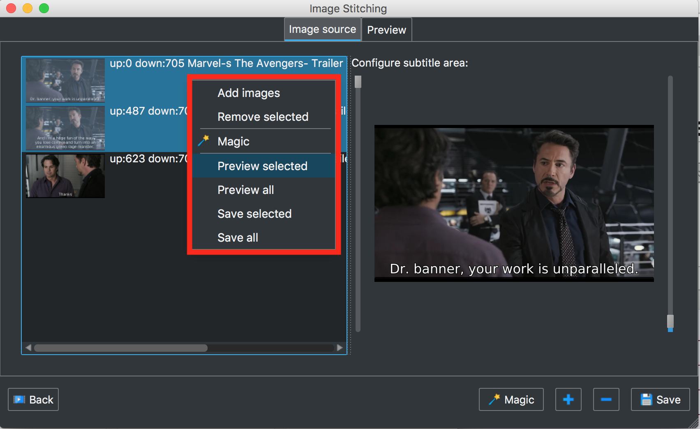

