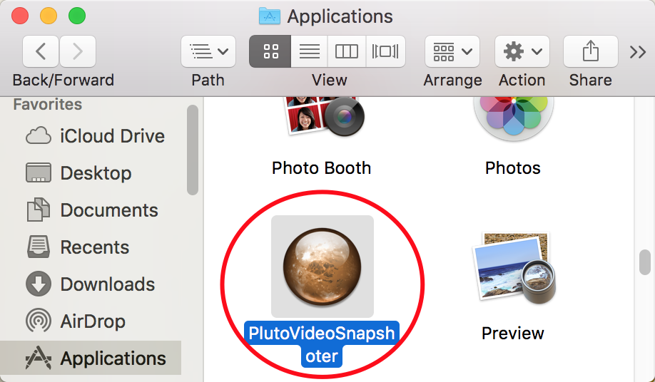

视频截图字幕拼接精灵使用说明
==============

## 启动应用

1. Windows下启动。

1. macOS下启动。

## 使用说明

1. 打开视频。

1. (可选) 选择截图存放路径。

1. (可选, 针对`Auto Snapshots`，这个是必选) 打开字幕文件 (*.srt). 如果字幕文件与视频文件是相同的文件名，这个字幕文件会被自动加载。注意：本软件现阶段并不支持渲染字幕到视频或者截屏上。

1. 播放视频或者手动截图（当视频被打开之后会立刻开始自动播放，此时，播放按钮会变成暂停，单机视频区域也可以播放或者暂停视频)。

1. 选择 `Start` 和 `End`, 之后就可以通过点击`Auto Anapshot`针对有字幕的每一帧自动进行截屏。

1. 跳转到`Image Stitching`。

1. 选择视频字幕上下区域。

1. 预览拼接效果。

1. 保存拼接的图片。

## 高级

1. 字幕区域自动识别。

1. 预览/保存选择性拼接。

